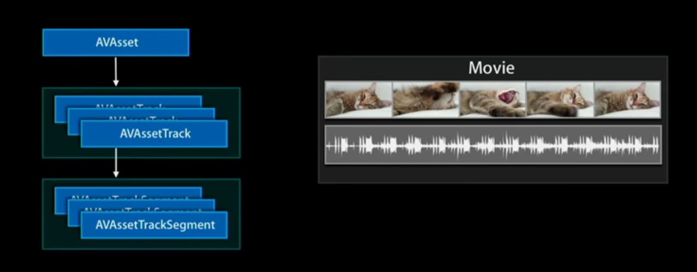
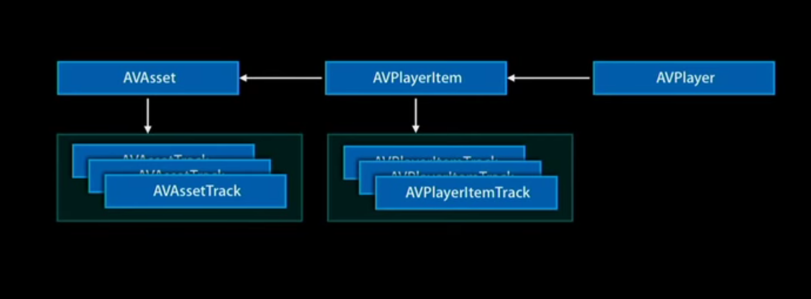
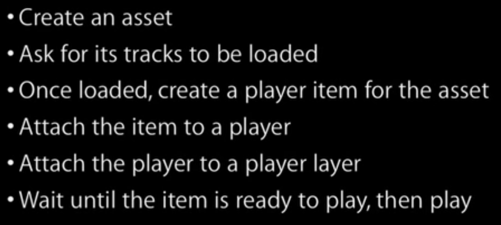

# Example Code for AVFoundation from WWDC 2011

## Playback

When working on playback, the main functionality is provided by the following three objects:
1. `AVAsset`: it is a class to represent the audio/video file to be processed.
2. `AVPlayer`: a controller over playback.
3. `AVPlayerLayer`: it is like the screen or display device where to show the audio/video scene.

### `AVAsset`

- Definition: A base class represents any timed audiovisual media.
    + Video, movies, songs...etc
    + Local or remote.
    + Finite or unbounded (streaming data).
- Structure: an `AVAsset` consists of two kind of objects
    + `AVAssetTrack`
        + `AVAssetTrackSegment`

### Basic Steps

### Example Project

See `tryAVFoundation.xcproj` for detail.

## References

- [Progress Bar](http://stackoverflow.com/questions/29542001/audio-playback-progress-as-uislider-in-swift)
- [Understanding AVFoundation](https://www.youtube.com/watch?v=mCiZW2xW4Ks)
- [Play Local Video](https://www.youtube.com/watch?v=bRhdFymK-eE)